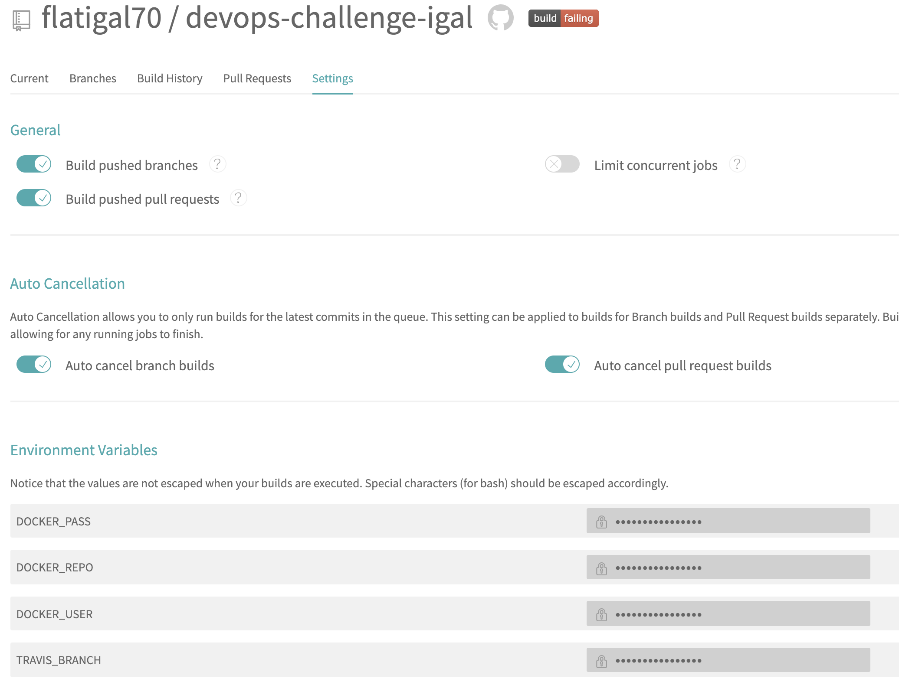
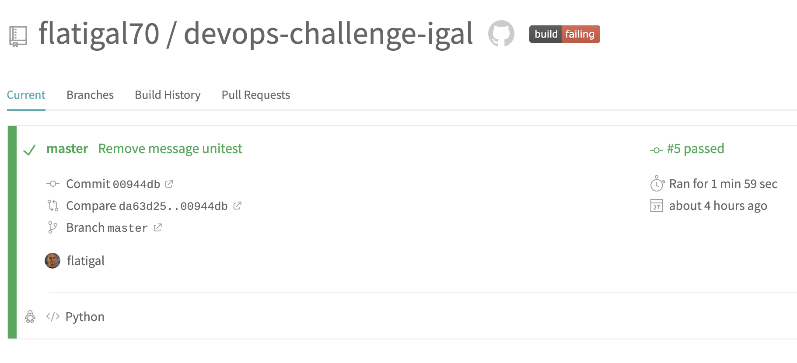
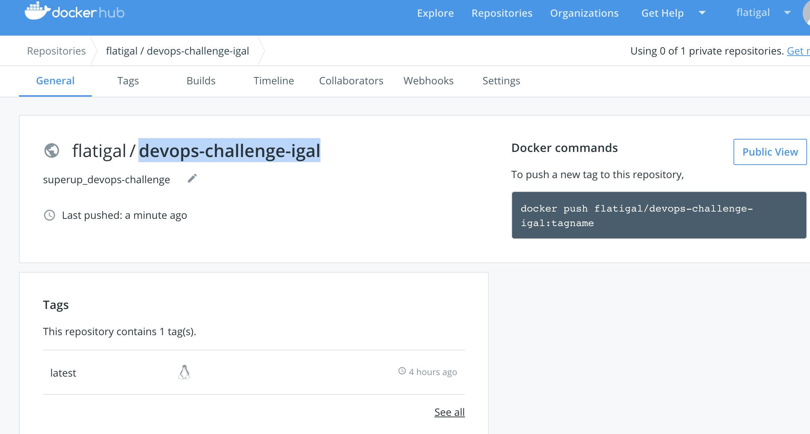

### Summary

1. Created `app.py` - simple web app with routers to "/", "/status" and "/message".
2. Created `crypt.py` - AESCipher class to encrypt/decrypt AES 128 ECB.
3. Created `DOCKERFILE` and `docker-compose.yml` - docker with local environments.
   `requirements.txt` contain all pip packets that should be installed for app.
4. Added unitest - `test_app.py`
5. Pushed code to `https://github.com/flatigal70/devops-challenge-igal.git` public repository.
6. Created `devops-challenge-igal` dockerhub public repository.
7. Opened account in `travis-ci.org`.
8. Created `.travis.yml` in root of git repository.
9. Created `travis/deploy_dockerhub.sh` to push dockers to dockerhub.
10. Enabled git repository in Travis and configured environments that we use in `deploy_dockerhub.sh`.

11. Performed commit in git check CI/CD process.

